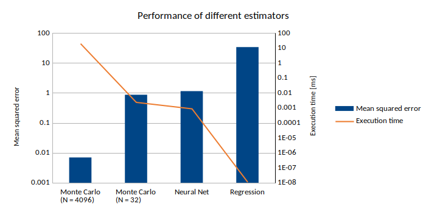

# GPU-Project

This was a project from an introductory course in CUDA programming at the Sorbonne University, Paris. We implemented the nested Monte-Carlo parallelly in order to price a bullet option at every triplet (t,x,j).  
Furthermore, we trained a linear regression and a neural network for interpolating the value function F(t,x,j). 

---
The results are presented in the [beamer presentation](BAUMANN_LUTZ_presentation.pdf). In the end we compared the accuracy and execution time of three models and visualized the results in the following plot: 

